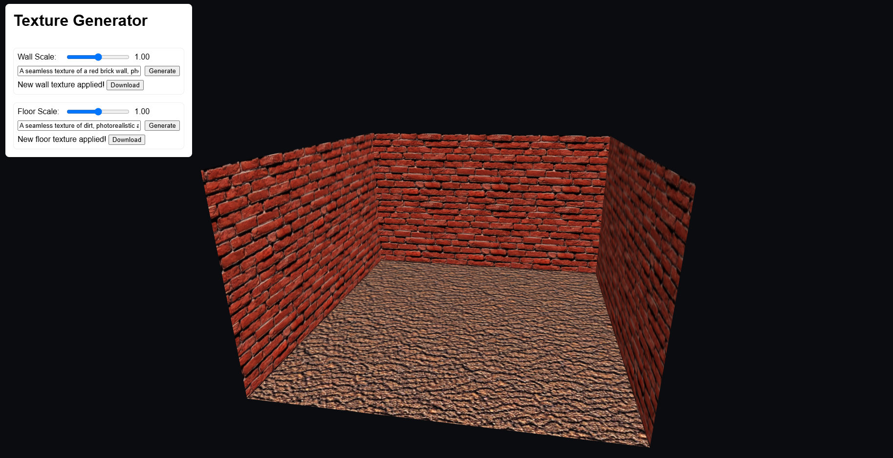

# Texture Generator

[](https://adamnizol.github.io/Texture-Generator/)

Welcome to **Texture Generator**, a simple hobby project designed to generate AI-based seamless textures in real-time for use in games, 3D scenes, or just for fun. Feel free to explore, modify, and incorporate this project into your own creative endeavors!

---

## Table of Contents
1. [Features](#features)
2. [Quick Start](#quick-start)
3. [Usage](#usage)
4. [Contributing](#contributing)
5. [License](#license)

---

[](https://adamnizol.github.io/Texture-Generator/)

---

## Features

- **AI-Powered Texture Creation**  
  Type a prompt describing your desired wall or floor texture and generate it on the spot.
- **Interactive Scaling**  
  Quickly adjust texture scale using slider controls for a perfect fit.
- **Real-Time Preview**  
  See your texture changes applied instantly to a simple 3D room (using Three.js).
- **Easy Downloads**  
  One-click downloads allow you to save your generated textures for later use.

---

## Quick Start

### Live Demo
- **No setup required!**  
  Simply visit the **[live demo here](https://adamnizol.github.io/Texture-Generator/)** to start generating textures right away.

### Local Installation
1. **Clone or Download** this repository.
2. Open `index.html` in your favorite web browser.
3. **(Optional)** If you want to customize or tweak the code, you can open it in any IDE or text editor and modify as needed.

---

## Usage

1. **Choose a Texture**  
   Select either the “Wall” or “Floor” section.
2. **Enter a Prompt**  
   Describe the texture you want. For example:
   ```
   A seamless texture of a red brick wall, photorealistic, weathered bricks
   ```
3. **Generate**  
Click the **"Generate"** button. The app will use Stable Horde’s API to create a new texture based on your prompt.
4. **Adjust Scale**  
Use the **range slider** to resize your texture in real time. 
5. **Download**  
If you like the result, click **"Download"** to save the generated texture locally.

---

## Contributing

Contributions of all sorts—bug fixes, new ideas, or any form of improvement—are welcome. Feel free to submit a pull request or open an issue if you notice something that could be enhanced.

---

## License

This project is a fun hobby undertaking and is released into the **public domain**. You are free to use, modify, copy, or distribute the code and generated textures for any purpose, commercial or non-commercial, with or without attribution. **No warranties** are provided, express or implied.

Enjoy creating with **Texture Generator**! If you have any questions or suggestions, feel free to reach out.

